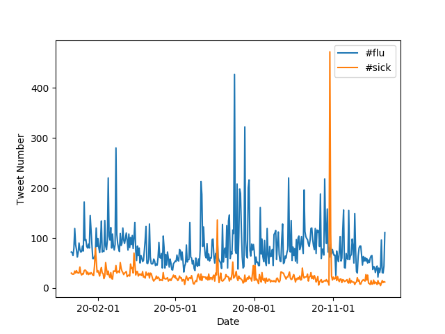

# 2020 Coronavirus Tweet Analysis 

## Project Overview

This project attempts to analyze the various tweets of 2020, especially with regard to hashtags relating the to the pandemic. We use the mapreduce method and the marplotlib library in order to analyze and visualize the data of about 1.1 billion tweets. Our goal is to get a sense of how different covid related words were used in different countries and languages. 

## Programming

We use the `map.py` file to process a zip file for an individual day outputs a file with JSON formatted information tracking language, and country. For example, the command below runs the `map.py` file for geotagged tweets on January first.
```
$ python3 ./src/map.py --input_path=/data/Twitter\ dataset/geoTwitter20-01-01.zip
```
The `run_maps.sh` is a shell script which runs the `map.py` on the zip files for the days of 2020. You can run the script by using this command:
```
$ nohup sh runmaps.sh & 
```
The `reduce.py` file combines the map.py outputs so we can visualize the tweets within 2020. The command below creates `reduce.country` which lets us look at the hashtag use in each country.
```
$ python3 ./src/reduce.py --input_paths outputs/geoTwitter20-*.country --output_path=reduced.country
```
This command uses the reduce.py file to generate `reduced.lang` which look at the use of certain hashtags in each language in 2020. 
```
$ python3 ./src/reduce.py --input_paths outputs/geoTwitter20-*.country --output_path=reduced.lang
```
## Visualizations

Finally, the `visualize.py` file generates a bar graph to display the data of the top 10 countries/languages that are using a certain hashtag. The `—-input_path` input (of either reduced.lang or reduced.country) displays the prevalence of the `-—key` input (the hashtag we are analyzing) with respect to different languages or countries. For example, the command below generates the following graph.
```
$ ./src/visualize.py --input_path=reduced.country --key='#coronavirus'
```
### Prevelance of #coronavirus in Different Countries in 2020


You can change the input paths and the key to generate the following graphs:

### Prevelance of #coronavirus in Different Languages in 2020


### Prevelance of #코로나바이러스 in Different Countries in 2020


### Prevelance of #코로나바이러스 in Different Languages in 2020


For the last part of this project, we created the alternative_reduce.py which takes —keys of different hashtags, and outputs a line graph displaying the prevalence of the keys throughout the 2020 year.

The command 
```
$ ./src/alternative_reduce.py --keys '#covid2019' '#hospital'
```
gives us the following graph:

### Use of #covid2019 and #hospital over the 2020 Year


Entering other keys can generate line graphs for different hashtags:

### Use of #flu and #sick over the 2020 Year


Thank you for reading!
